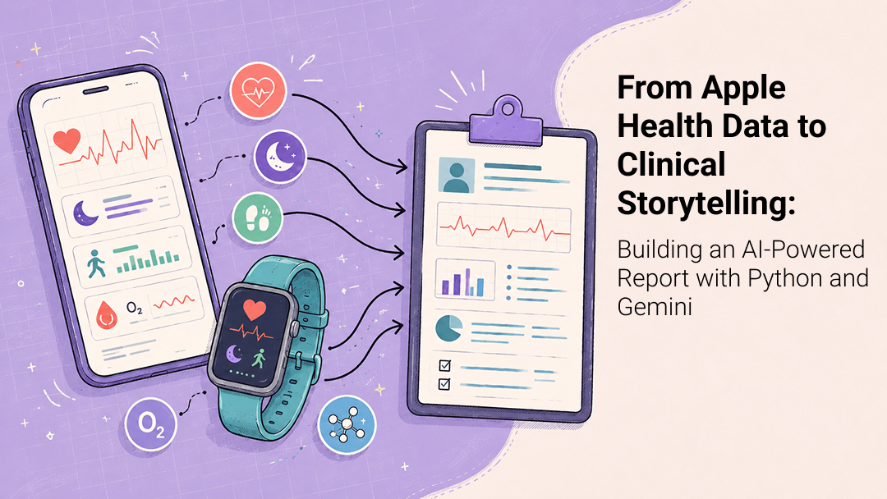
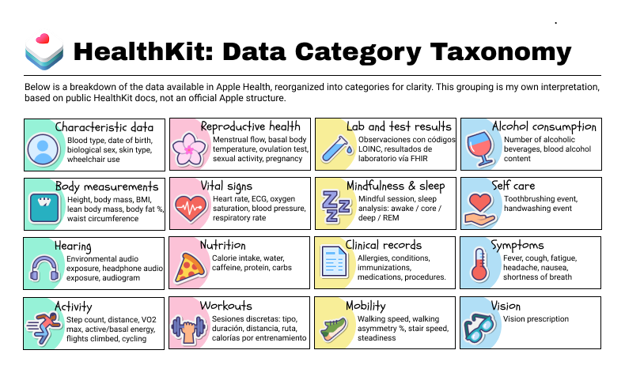
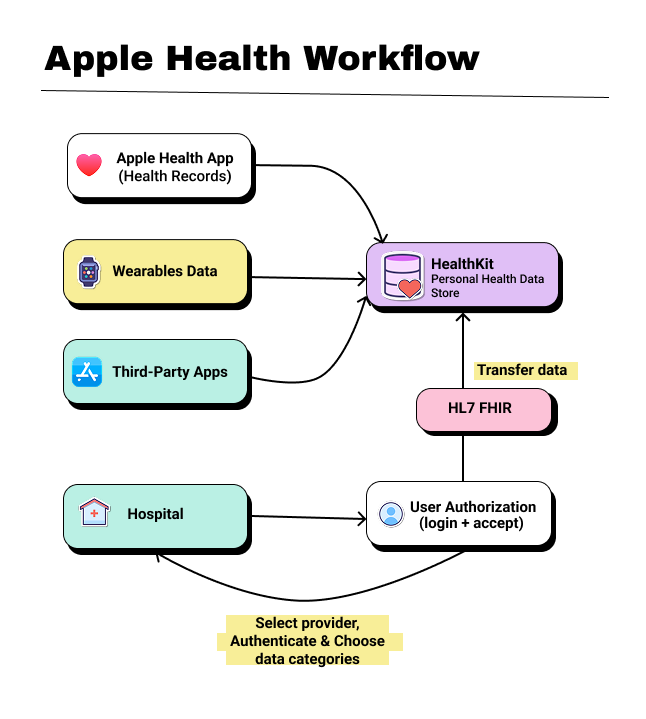
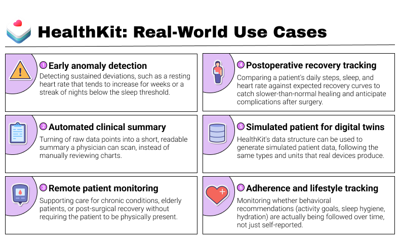
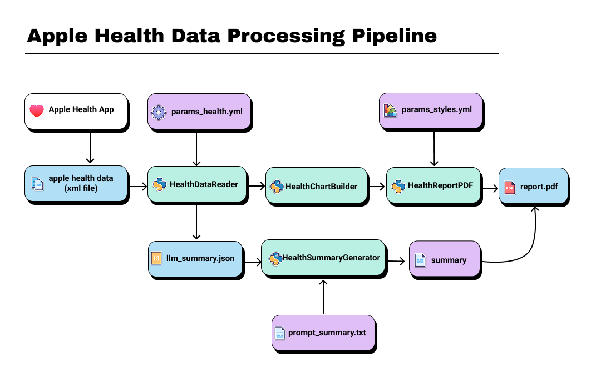

[](https://www.buymeacoffee.com/r0mymendez)

---

# From Apple Health Data to Clinical Storytelling: Building an AI-Powered Report with Python and Gemini
# Apple Health Reporting Pipeline with Python and Gemini

A modular Python pipeline that processes Apple Health XML exports, calculates health metrics, generates visualizations, creates an AI-assisted narrative with Gemini, and builds a structured PDF report.



> This repository is an educational MVP built with simulated data. It is not a medical device, diagnostic tool, or production-ready clinical solution.

## Overview

The pipeline:

1. Reads and normalizes Apple Health XML records.
2. Calculates mobility, cardiovascular, and sleep metrics.
3. Compares results with configurable reference values.
4. Generates charts with Matplotlib.
5. Creates a structured narrative with Gemini.
6. Combines metrics, charts, and text into a PDF report.


## HealthKit: The Framework Behind the Data

HealthKit is Apple’s framework for storing and sharing health and fitness information collected by the iPhone, Apple Watch, third-party apps, and compatible devices.

It provides standardized data types for metrics such as heart rate, steps, sleep, blood oxygen, and mobility. This consistent structure makes the data easier to process and allows authorized applications to interpret the same records in a common way.



## HL7 / FHIR Compatibility

Apple Health can also work with structured clinical records through Health Records. These records use HL7 FHIR, a standard designed to exchange healthcare information between applications, hospitals, and Electronic Health Record systems.



FHIR represents information through reusable resources such as `Patient`, `Observation`, `Condition`, and `MedicationRequest`. In a real implementation, this interoperability could make it easier to connect the pipeline with other healthcare platforms instead of depending only on an isolated XML export.

## HealthKit: Clinical Use Cases



The value of wearable data comes not only from individual measurements, but also from its continuity over time. Long-term records can support use cases such as:

- remote patient monitoring;
- mobility and fall-risk analysis;
- post-operative follow-up;
- sleep and cardiovascular trend analysis;
- clinical summary generation;
- synthetic data generation for research.


## Architecture



- `HealthDataReader` — parses the XML export and calculates metrics.
- `HealthChartBuilder` — generates charts from the processed data.
- `HealthSummaryGenerator` — sends a compact summary to Gemini and generates the narrative.
- `HealthReportPDF` — builds the final PDF report with ReportLab.

## Report Sections

- 🚶 **Mobility** — steps, walking speed, steadiness, gait metrics, and calories.
- ❤️ **Cardiovascular** — resting heart rate, HRV, SpO₂, VO₂ Max, and recovery metrics.
- 😴 **Sleep** — average duration and nights above or below configured thresholds.
- 🤖 **AI-Generated Summary** — structured narrative based on previously calculated metrics.

## Requirements

- Python 3.10+
- A Gemini API key
- An Apple Health XML export or one of the simulated files included in `patients/`

Install the dependencies:

```bash
pip install -r requirements.txt
```

Create a `.env` file in the project root:

```env
gemini_api_key=YOUR_CREDENTIAL
```

## Run the Pipeline

```bash
python main.py
```

Generated files are saved in:

```text
data/      # Compact JSON summaries
charts/    # Generated visualizations
reports/   # Final PDF reports
```

## Configuration

The project uses configuration files to keep parameters outside the Python code:

- `config/params_health.yml` — reference values and thresholds.
- `config/params_styles.yml` — chart and PDF color palette.
- `prompt/prompt_summary.txt` — instructions used to generate the Gemini narrative.

The included thresholds are for demonstration only. They should be reviewed and validated before adapting the project to a real use case.

## Simulated Data

The repository includes three simulated Apple Health XML files:

- `alex_28m.xml`
- `carlos_68m.xml`
- `maria_61f.xml`

These files make it possible to reproduce the pipeline without exposing real health information.

## Design Decisions

The main calculations remain in Python. Gemini receives a compact JSON summary and is used only to organize the results into readable text.

This approach helps:

- keep calculations reproducible and testable;
- reduce token usage and execution cost;
- avoid sending the full XML export to the model;
- separate deterministic processing from generative output.

## Limitations

Before using a similar pipeline with real data, additional work would be required around:

- data quality and completeness;
- missing records, outliers, and duplicated measurements;
- security, privacy, consent, and retention policies;
- clinical validation of metrics and thresholds;
- evaluation and human review of generated text;
- regulatory and platform requirements.

## Disclaimer

This project uses simulated data and is intended for educational and experimental purposes only. The generated reports and AI summaries must not be used to make medical or health-related decisions.